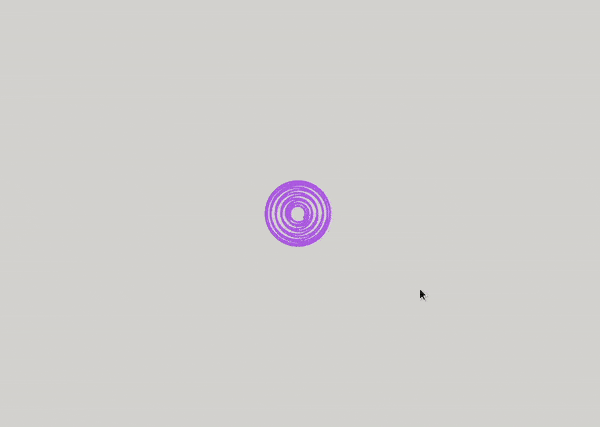
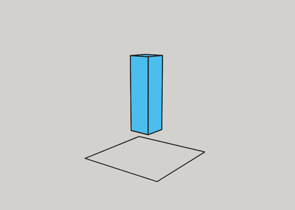
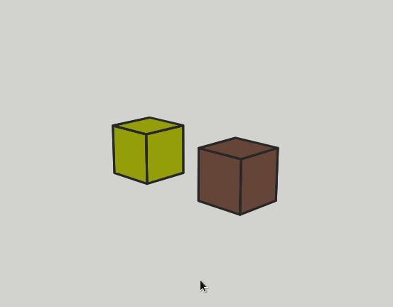
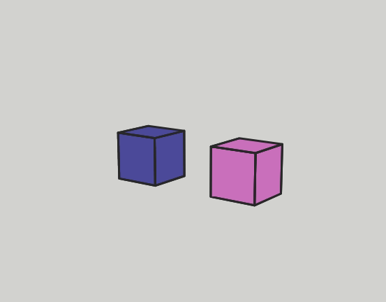

## what is this?

this is a small library to render 3 dimensional objects using only [CanvasRenderingContext2D](https://developer.mozilla.org/de/docs/Web/API/CanvasRenderingContext2D).  

## great, how can i use it?  

`npm install @flurrux/simple-ctx-3d-engine`  

for more details, see [example code](#example-code) below.  

## why does it look weird sometimes?  

there is no occlusion!  
the order of the objects rendered needs to be determined by yourself. maybe use the util function `sortByCamSpaceZ` in `./src/sorting-util.ts`  
see [occlusion sorting](#simple-occlusion-sorting) below.  


## why would i use this over webgl?  

granted, webgl is superior to this humble engine (if you can call it that) in almost every regard.  
however, there is so much overhead when setting up a webgl scene. for small projects i much prefer this lightweight and familiar engine (i'll call it an engine, suck it).  

# example code

## polyline  
---

```
import { normalizedValues } from "@flurrux/simple-ctx-3d-engine/lib/array-range-util";
import { setupSimpleCtx3dScene } from "@flurrux/simple-ctx-3d-engine/src/index";

const spiral = normalizedValues(500).map(v => v - 0.5).map(
	p => {
		const angle = 80 * p;
		const radius = 0.3 * (1 + 0.6 * Math.cos(6 * p));
		return vector3(
			radius * Math.sin(angle),
			radius * Math.cos(angle),
			3 * p
		)
	}
);

setupSimpleCtx3dScene({
	renderScene: (args) => {
		drawPolyline3D(args)(spiral, { lineWidth: 3, strokeStyle: "#b26be8" });
	}
});
```
 



## animated cube    

---

```
import { setupSimpleCtx3dScene } from "@flurrux/simple-ctx-3d-engine/src/index";
import { startLoop } from "@flurrux/simple-ctx-3d-engine/lib/loop-util";
import { multiplyMatrix, rotation, scale } from "@flurrux/simple-ctx-3d-engine/lib/mat3x3";
import { add } from "@flurrux/simple-ctx-3d-engine/lib/vec3";
import { cubeFaceMesh } from "@flurrux/simple-ctx-3d-engine/src/objects/cube-geometry";
import { drawFaceMesh, FaceMesh } from "@flurrux/simple-ctx-3d-engine/src/objects/face-mesh";
import { drawPolyline3D } from "@flurrux/simple-ctx-3d-engine/src/objects/polyline";
import { XZQuadVertices } from "@flurrux/simple-ctx-3d-engine/src/objects/quad-geometry";
import { setupSimpleCtx3dScene } from "@flurrux/simple-ctx-3d-engine/src/scene-setup";

let cuboidMesh: FaceMesh = cubeFaceMesh;

const sceneController = setupSimpleCtx3dScene({
	renderScene: (args) => {
		drawPolyline3D(args)(
			XZQuadVertices.map(v => add(v, [0, -1.2, 0])), 
			{ strokeStyle: "#292929", lineWidth: 3 }
		);
		drawFaceMesh(args)(
			cuboidMesh,
			{ fillStyle: "#42b6f5", strokeStyle: "#292929", lineWidth: 3 }
		);
	}
});

startLoop(
	({t}) => {
		cuboidMesh = {
			...cuboidMesh,
			transform: {
				position: [0, Math.sin(t) * 0.26, 0],
				orientation: multiplyMatrix(
					rotation([0, t, 0]),
					scale([0.5, 1.7, 0.5])
				)
			}
		};
		sceneController.performRender();
	}
);
```




## simple occlusion sorting  
---

```
import { randomColor } from "@flurrux/simple-ctx-3d-engine/lib/random-util";
import { vector3 } from "@flurrux/simple-ctx-3d-engine/lib/vec3";
import { cubeFaceMesh } from "@flurrux/simple-ctx-3d-engine/src/objects/cube-geometry";
import { drawFaceMesh, FaceMesh, getPosition } from "@flurrux/simple-ctx-3d-engine/src/objects/face-mesh";
import { setupSimpleCtx3dScene } from "@flurrux/simple-ctx-3d-engine/src/scene-setup";
import { sortByCamSpaceZ } from "@flurrux/simple-ctx-3d-engine/src/sorting-util";

type FaceMeshWithColor = FaceMesh & { color: string };

const cubes: FaceMeshWithColor[] = [vector3(-1.2, 0, 0), vector3(+1.2, 0, 0)].map(
	position => ({
		...cubeFaceMesh,
		transform: {
			...cubeFaceMesh.transform,
			position,
		},
		color: randomColor()
	})
);

const useOcclusionSorting = false;

setupSimpleCtx3dScene({
	renderScene: (args) => {
		let cubesToRender = cubes;
		if (useOcclusionSorting){
			cubesToRender = sortByCamSpaceZ(getPosition, args.worldToCam)(cubes);
		}
		cubesToRender.forEach(
			cube => drawFaceMesh(args)(
				cube,
				{ fillStyle: cube.color, strokeStyle: "#292929", lineWidth: 3 }
			)
		);
	}
});
```

with `const useOcclusionSorting = false;`  



with `const useOcclusionSorting = true;`  

